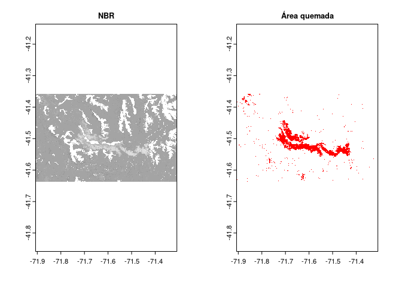

## **2. CÁLCULOS DE SUPERFICIES POR CATEGORÍA DE SEVERIDAD**

### **2a. Obtener el perímetro del incendio**

En esta sección de utilizará el **archivo raster dNBR** exportado con
rgee. Se asume que luego de exportado, fue descargado a un directorio en
la PC local. Por lo tanto debe ser importado a la sesión de R. Para la
manipulación de datos espaciales se usará la librería `terra`

``` r
library(terra)

# Importar el raster 
nbr_wgs84 <- rast(paste0("_rasters/dNBR_scaled_masked.tif")) 

# Proyectar a un sistema de coordenadas planas
nbr_posgar1 <- terra::project(nbr_wgs84, "EPSG:22181")
```

Para obtener el perímetro, primero hay que definir un **umbral de
clasificación de píxeles quemados vs. píxeles no quemados**. En este
caso se utilizó 100 en concordancia con el corte establecido por las
categorías propuestas por USGS.

``` r
# Definir umbral de corte entre área quemada
umbral <- 100

# Clasificar área quemada vs. no quemada
perimeter <- classify(nbr_wgs84, cbind(-Inf, umbral, NA))   # NA a valores entre -Inf y el umbral
perimeter <- classify(perimeter, cbind(umbral, Inf, 1))     # 1 a valores mayores al umbral - Quemados

# Plot
par(mfrow=c(1,2))    
plot(nbr_wgs84, main = "NBR", col = grey.colors(15), legend = FALSE)
plot(perimeter, main = "Área quemada", legend = FALSE, col = "red")
```

<!-- -->
