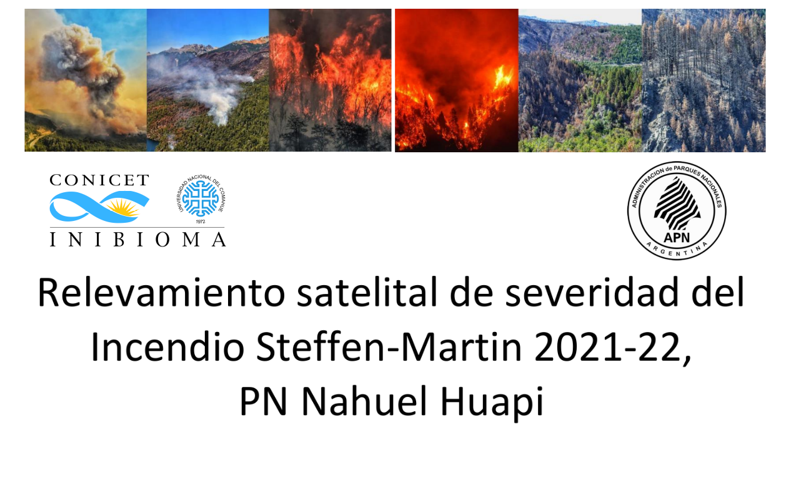
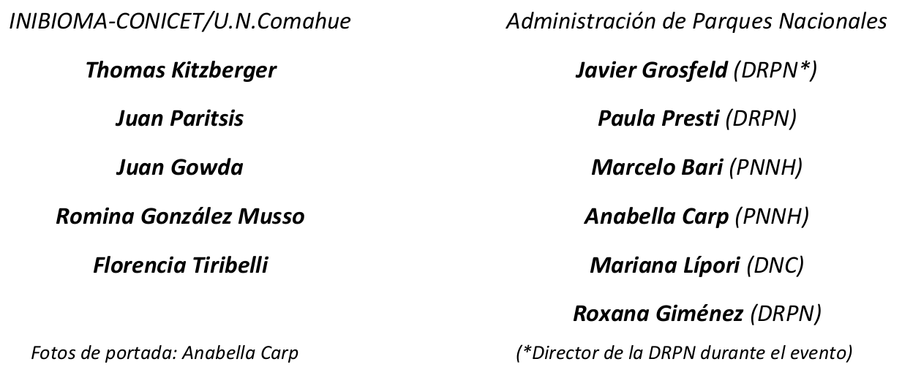

```{r setup, include=FALSE}
knitr::opts_chunk$set(echo = TRUE)
```

```{r, echo=FALSE, out.width="70%", fig.cap="", fig.align="center"}



```

```{r, echo=FALSE, out.width="70%", fig.cap="", fig.align="center"}



```

----------------------------------------
### **ÍNDICE DE CONTENIDOS**

Este repositorio contiene el material accesorio y los códigos para determinar el índice de severidad de incendios y los cálculos de superficies afectadas usando Google Earth Engine (GEE) a través de la librería `rgee` en R, de acuerdo a la metodología detallada en el Informe Técnico.

- [**1.** Obtención de imágenes con `rgee` y cáculo de NBR (Índice de Severidad de Incendios)](https://github.com/romina-gonzalez-musso/Severidad_IncendioLagoMartin/tree/master/_mds/1_Imagenes_rgee.md)

- [**2.** Obtención del perímetro del incendio y clasificación por clases de severidad USGS ](https://github.com/romina-gonzalez-musso/Severidad_IncendioLagoMartin/tree/master/_mds/2_NBR.md)

- [**3.** Superficies afectadas por tipo de bosque y clases de severidad USGS ](https://github.com/romina-gonzalez-musso/Severidad_IncendioLagoMartin/tree/master/_mds/3_Tipos_ftales.md)


#### **CITA**

- [Kitzberger T., Paritsis J., Gowda J., Gonzalez Musso R., Tiribelli F., Grosfeld J., Presti P., Bari M., Carp A., Giménez R., Lípori M. 2023. Relevamiento satelital de severidad y estimaciones de trayectorias sucesionales de bosques afectados por el Incendio Steffen‐Martin 2021‐22, Parque Nacional Nahuel Huapi. Macroscopía: divulgación ténico científica del patrimonio natural y cultural del Parque Nacional Nahuel Huapí. Vol. 11: p8‐14.](https://www.nahuelhuapi.gov.ar/multimedios/macroscopia_11.pdf)


#### **BIBLIOGRAFÍA MENCIONADA EN EL REPOSITORIO**

- Aybar C., Wu Q., Bautista L., Yali R., Barja A. 2020. rgee: An R package for interacting with Google Earth Engine Journal of Open Source Software [https://github.com/r-spatial/rgee/](https://github.com/r-spatial/rgee/)

- CIEFAP, MAyDS, 2016. Actualización de la Clasificación de Tipos Forestales y Cobertura del Suelo de la Región Bosque Andino Patagónico. Informe Final. [Acceso el documento](https://www.argentina.gob.ar/sites/default/files/informe_final_ccs_bap_20160712.pdf)

- Parks S.A, Dillon G.K., Miller C. 2014. A new metric for quantifying burn severity: the relativized burn ratio. Remote Sens. 6: 1827-1844. [https://doi.org/10.3390/rs6031827](https://doi.org/10.3390/rs6031827)


