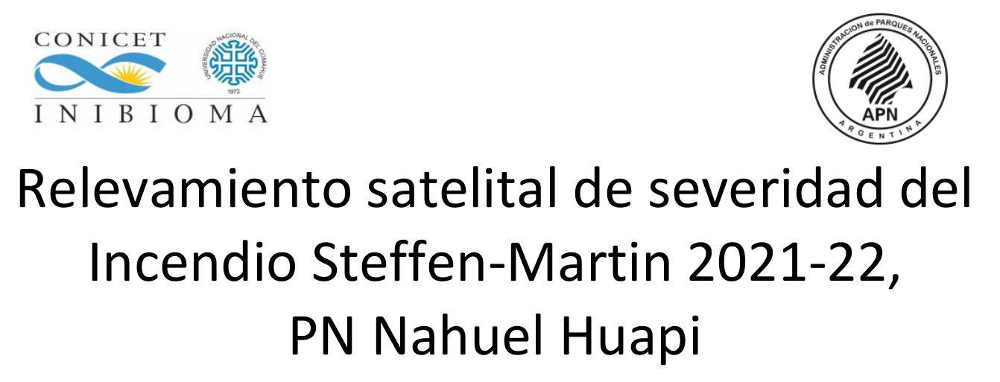
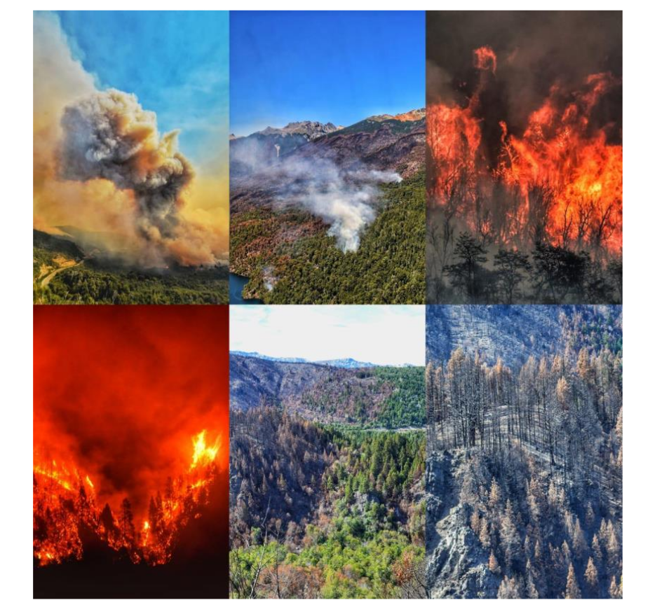
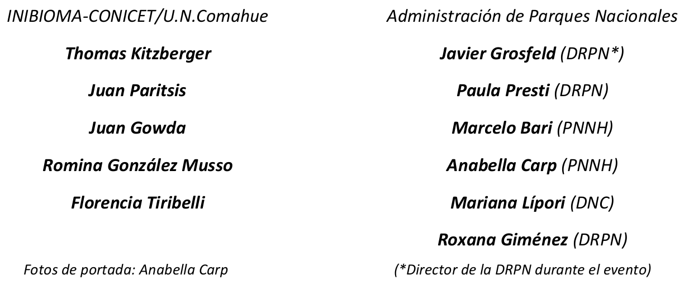

------------------------------------------------------------------------

### **ÍNDICE DE CONTENIDOS**

Para garantizar la reproducibilidad de los resultados publicados en el
Informe y proponer un protocolo estandarizado para relevar
satelitalmente severidad ante futuros eventos de incendio, este
repositorio contiene el material los códigos para determinar el índice
de severidad de incendios y los cálculos de superficies usando Google
Earth Engine (GEE) a través de la librería `rgee` en R.

-   [**1.** Obtención de imágenes con `rgee` y cáculo de NBR (Índice de
    Severidad de
    Incendios)](https://github.com/romina-gonzalez-musso/Severidad_IncendioLagoMartin/tree/master/_mds/1_Imagenes_rgee.md)

-   [**2.** Obtención del perímetro del incendio y clasificación por
    clases de severidad
    USGS](https://github.com/romina-gonzalez-musso/Severidad_IncendioLagoMartin/tree/master/_mds/2_NBR.md)

-   [**3.** Superficies afectadas por tipo de bosque y clases de
    severidad
    USGS](https://github.com/romina-gonzalez-musso/Severidad_IncendioLagoMartin/tree/master/_mds/3_Tipos_ftales.md)

#### **BIBLIOGRAFÍA**

-   Aybar C., Wu Q., Bautista L., Yali R., Barja A. 2020. rgee: An R
    package for interacting with Google Earth Engine Journal of Open
    Source Software <https://github.com/r-spatial/rgee/>

-   CIEFAP, MAyDS, 2016. Actualización de la Clasificación de Tipos
    Forestales y Cobertura del Suelo de la Región Bosque Andino
    Patagónico. Informe Final. [Acceso el
    documento](https://www.argentina.gob.ar/sites/default/files/informe_final_ccs_bap_20160712.pdf)

-   Parks S.A, Dillon G.K., Miller C. 2014. A new metric for quantifying
    burn severity: the relativized burn ratio. Remote Sens. 6:
    1827-1844. <https://doi.org/10.3390/rs6031827>
