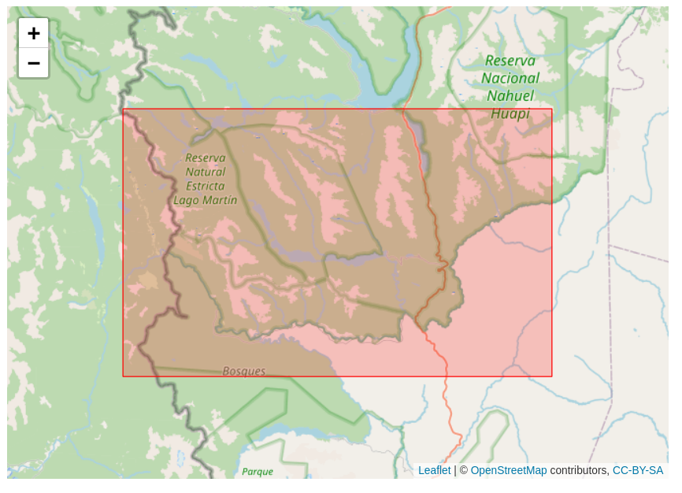
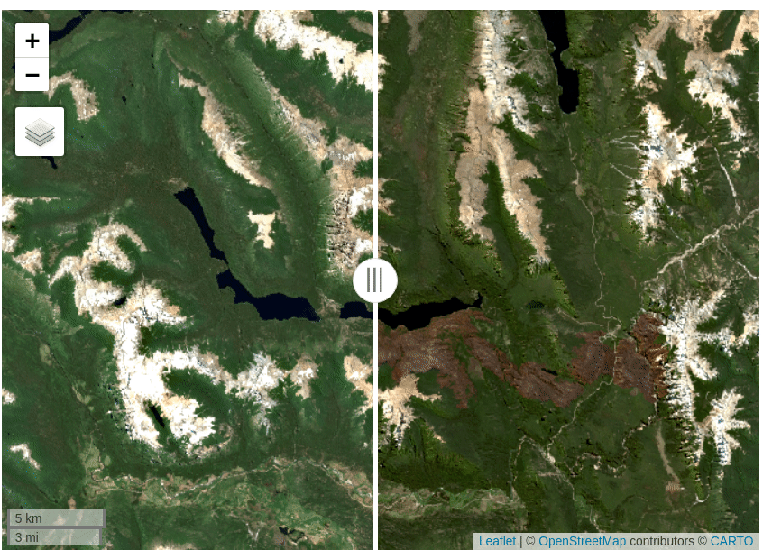
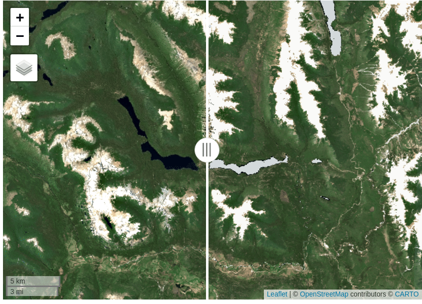
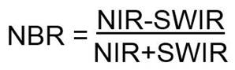
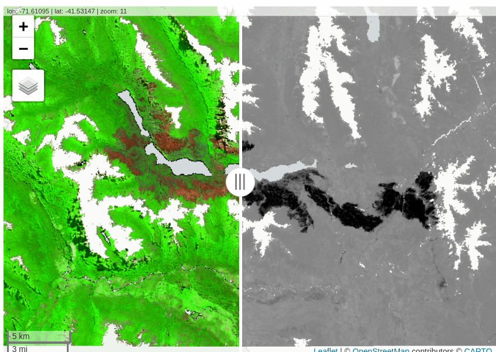
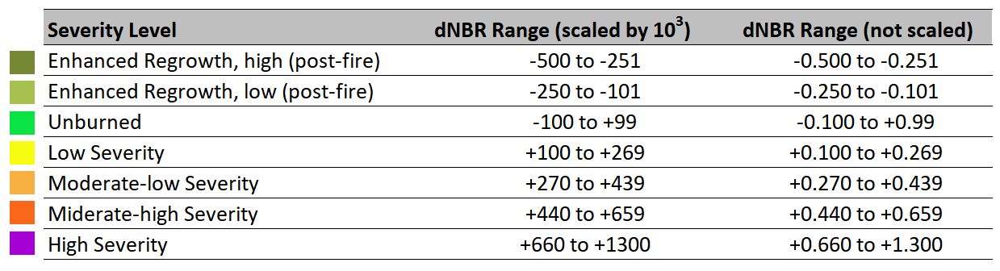
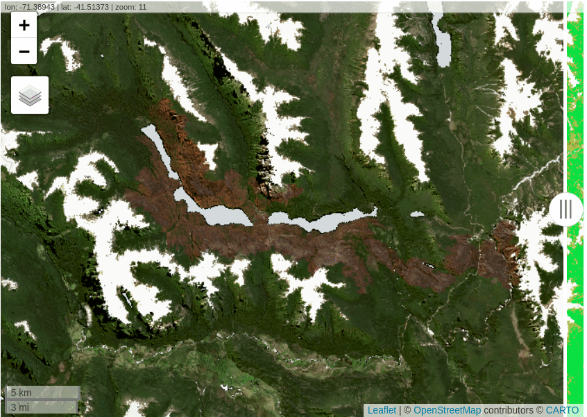

Relevamiento satelital de severidad del Incendio Complejo Lago Martin
2021-22
================

-   <a href="#intro" id="toc-intro"><strong>PRESENTACION</strong></a>
-   <a href="#intro2" id="toc-intro2"><strong>1. BÚSQUEDA Y DESCARGA DE
    IMÁGENES</strong></a>
    -   <a href="#rgee" id="toc-rgee"><strong>1a. Instalar rgee</strong></a>
    -   <a href="#area" id="toc-area"><strong>1b. Indicar área y fechas de
        interés</strong></a>
    -   <a href="#imcol" id="toc-imcol"><strong>1c.Traer la colección de
        imágenes de GEE (ImageCollection)</strong></a>
    -   <a href="#vis" id="toc-vis"><strong>1d. Visualizar las
        imágenes</strong></a>
    -   <a href="#mascaras" id="toc-mascaras"><strong>1e. Opcional: aplicar
        máscaras de agua y vegetación</strong></a>
    -   <a href="#nbr" id="toc-nbr"><strong>1f. Cáculo de índice NBR (Índice
        Normalizado de Área Quemada)</strong></a>
    -   <a href="#severidad" id="toc-severidad"><strong>1.g. Categorías de
        severidad USGS</strong></a>
    -   <a href="#export" id="toc-export"><strong>1.h. Exportar imágenes a
        Google Drive</strong></a>
-   <a href="#intro3" id="toc-intro3"><strong>2. DELIMITACIÓN DEL ÁREA DEL
    INCENDIO</strong></a>
    -   <a href="#perimetro" id="toc-perimetro"><strong>2.a. Obtener el
        perímetro</strong></a>
    -   <a href="#export2" id="toc-export2"><strong>2.b. Exportar perímetro en
        formato shape</strong></a>
-   <a href="#intro4" id="toc-intro4"><strong>3. CALCULAR
    SUPERFICIES</strong></a>
    -   <a href="#sup1" id="toc-sup1"><strong>3.1. Calcular superficies por
        clases de severidad</strong></a>
-   <a href="#referencias" id="toc-referencias"><strong>9.
    REFERENCIAS</strong></a>

<a id="intro"></a>

## **PRESENTACION**


<br> Servicio Técnico de Alto Nivel (STAN)

**Relevamiento satelital del incendio forestal complejo Lagos Martin y
Steffen**

Autores: Thomas Kitzberger, Juan Gowda, Juan Paritsis, Romina Gonzalez
Musso

Este repositorio corresponde al código anexo para determinar el índice
de severidad de incendios y cálculos de superficies usando Google Earth
Engine (GEE) a través de la librería rgee en R.

Actualización: mayo 2022

<a id="intro2"></a>

## **1. BÚSQUEDA Y DESCARGA DE IMÁGENES**

<a id="rgee"></a>

### **1a. Instalar rgee**


**rgee** es una librería que permite llamar a la API de Google Earth
Entine usando R (Aybar et al. 2020).

El paquete se instala en R como cualquier otro paquete ejecutando
`install.packages(rgee)`. Luego es necesario configurar por única vez el
entorno de trabajo e indicar las credenciales de acceso a la cuenta de
Google Earth Engine (GEE) del usuario. Para esto, luego de instalar el
paquete se ejecuta `rgee::ee_install()` y se siguen las indicaciones. La
guía detallada de instalación de rgee se puede leer en la página oficial
del desarrollo: <https://github.com/r-spatial/rgee>

Una vez instalada, cargamos la librería rgee e iniciamos la API de GEE:

``` r
library("rgee")
ee_Initialize()
```

<a id="area"></a>

### **1b. Indicar área y fechas de interés**

Una forma de indicar el **área de estudio** es usando un shape propio.
Para eso usamos la librería `sf` y le indicamos dónde tenemos alojado en
nuestro sistema el archivo shape.

``` r
library("sf")
shape <- st_read("/home/romina/Descargas/Steffen-Martin/SHAPES_RASTERS/area_incendio.shp")
```

Usando `leflet`, desplegamos el shape:

``` r
library("leaflet")
leaflet(shape) %>%
  addTiles() %>% 
  addPolygons(color = "red", weight = 1, opacity = 1.0)
```



Finalmente, convertimos el objeto `sf` a objeto rgee:

``` r
shape_ee <- sf_as_ee(shape$geometry)
```

Ahora hay que definir las **fechas**. Para este caso ya se habían
elegido dos imágenes Sentinel 2 libre de nubes usando visores de
imágenes externos. Por lo tanto, se acota el período de fechas para que
tome únicamente la imagen del día de interés.

``` r
pre_fire <- c('2021-12-05', '2021-12-07')    # Fecha de interés: 6/12/21
post_fire <- c('2022-03-10', '2022-03-12')   # Fecha de interés: 11/03/22
```

<a id="imcol"></a>

### **1c.Traer la colección de imágenes de GEE (ImageCollection)**

Traemos la colección de imágenes Sentinel 2 de GEE y la filtramos por
las fechas y el área de estudio.

``` r
Imcol <- ee$ImageCollection('COPERNICUS/S2_SR_HARMONIZED')

# PRE INCENDIO
PostImcol <- Imcol$
  filterDate(post_fire[1], post_fire[2])$
  filterBounds(shape_ee)

# POST INCENDIO
PreImcol <- Imcol$
  filterDate(pre_fire[1],pre_fire[2])$
  filterBounds(shape_ee)
```

Verificamos que al acotar el rango de fechas únicamente a la imagen
deseada, cada colección de imágenes tendrá una sola imagen.

``` r
length(PostImcol) # Ejemplo consultando la colección de imágenes post-incendio
```

    ## [1] 1

Convertimos la ImageCollection en una Imagen y la recortamos al área de
estudio:

``` r
PreImage <- PreImcol$mosaic()$clip(shape_ee)
PostImage <- PostImcol$mosaic()$clip(shape_ee)
```

<a id="vis"></a>

### **1d. Visualizar las imágenes**

Primero definimos los parámetros de visualización:

``` r
viz_true_color <- list(
  bands=c('B4', 'B3', 'B2'),
  min = 10,
  max = 2000,
  gamma = 1.5)

viz_swir <- list(
  bands=c('B12', 'B8A', 'B4'),
  min = 150,
  max = 4000,
  gamma = 1.5)
```

Agregamos las imágenes PRE y POST en visualización falso color SWIR y
color verdadero

``` r
Map$centerObject(shape_ee, zoom = 10)
Map$addLayer(PreImage, viz_true_color, 'Pre-fuego RGB') +
Map$addLayer(PreImage, viz_swir, 'Pre-fuego SWIR') +
Map$addLayer(PostImage, viz_swir, 'Post-fuego SWIR')+
Map$addLayer(PostImage, viz_true_color, 'Post-fuego RGB')
```




<a id="mascaras"></a>

### **1e. Opcional: aplicar máscaras de agua y vegetación**

Se pueden aplicar máscaras para eliminar las áreas sin vegetación y los
lagos, de manera que los índices sean aplicados solo a las zonas de
bosque.

En este caso la máscara de agua se generó a partir del producto
`GlobalSurfaceWater`:

``` r
# Máscara de agua con Global Surface Water
gsw <- ee$Image("JRC/GSW1_2/GlobalSurfaceWater")
water_mask <- gsw$select('seasonality')$lt(11)$unmask(1)$clip(shape_ee)
```

La máscara de vegetación de puede generar usando el `GlobalForestWatch`
pero en este caso se utilizó un umbral de NDVI de la imagen Pre-incendio
para eliminar los afloramientos rocosos de las cumnbres.

``` r
getIndexes <- function(image) {
  ndwi <- image$normalizedDifference(c("B3", "B5"))$rename('NDWI')
  ndvi <- image$normalizedDifference(c("B8", "B4"))$rename('NDVI')
  return(image$addBands(c(ndvi, ndwi)))
}

indices <- getIndexes(PreImage)

# Máscaras de vegetación con NDVI
veg_mask <- indices$select('NDVI')$gte(0.15)$unmask(1)$clip(shape_ee)
```

Se aplican las máscaras a las imágenes:

``` r
## Aplicar máscaras 
PreImage <- PreImage$mask(water_mask)$mask(veg_mask)
PostImage <- PostImage$mask(water_mask)$mask(veg_mask)
```



<a id="nbr"></a>

### **1f. Cáculo de índice NBR (Índice Normalizado de Área Quemada)**

El índice NBR se calcula a partir de la relación entre las bandas NIR y
SWIR:



``` r
preNBR <- PreImage$normalizedDifference(c("B8", "B12"))
postNBR <- PostImage$normalizedDifference(c("B8", "B12"))
```

La diferencia entre ambos NBR permite estimar **la severidad del
incendio**.

``` r
# dNBR
dNBR_unscaled <-preNBR$subtract(postNBR)
```

Teniendo en cuenta los cambios fenológicos entre ambas fechas, se
calculó el dNRB `offset` (Parks et al. 2014) y luego se escalaron los
resultados de acuerdo a los valores propuestos por USGS.

``` r
# dNRB offset
offset <- 0.0277  # Calculado específicamente para este caso
dNBR_unscaled <- dNBR_unscaled$subtract(offset)

# Escalado a los estándars USGS
dNBR_scaled <- dNBR_unscaled$multiply(1000)
```

Ahora configuramos la **visualización**

``` r
viz_grayscale <- list(palette = c("White", "Black"), 
                      min = -1000,
                      max = 1000)

Map$addLayer(PostImage, viz_true_color, 'Post-fuego RGB') +
Map$addLayer(dNBR_scaled, viz_grayscale, 'dNBR GREY')
```



<a id="severidad"></a>

### **1.g. Categorías de severidad USGS**

La USGS propone una una clasificación de severidad para interpretar los
resultados del índice:



Fuente: <https://un-spider.org/es/node/10959>

Se determina una paleta de colores (`sld_intervals`) para clasificar el
dNBR en función a la tabla anterior:

``` r
sld_intervals <- paste0(
  "<RasterSymbolizer>",
  '<ColorMap type="intervals" extended="false" >',
  '<ColorMapEntry color="#ffffff" quantity="-500" label="-500"  />',
  '<ColorMapEntry color="#7a8737" quantity="-250" label="-250"  />',
  '<ColorMapEntry color="#acbe4d" quantity="-100" label="-100" />',
  '<ColorMapEntry color="#0ae042" quantity="100" label="100" />',
  '<ColorMapEntry color="#fff70b" quantity="270" label="270" />',
  '<ColorMapEntry color="#ffaf38" quantity="440" label="440" />',
  '<ColorMapEntry color="#ff641b" quantity="660" label="660" />',
  '<ColorMapEntry color="#a41fd6" quantity="2000" label="2000" />',
  "</ColorMap>",
  "</RasterSymbolizer>"
)
```

Visualizar los resultados en función a las categorías USGS:

``` r
Map$addLayer(PostImage, viz_true_color, 'Post-fuego RGB') +
Map$addLayer(dNBR_scaled$sldStyle(sld_intervals), {}, 'dNBR classified')
```



<a id="export"></a>

### **1.h. Exportar imágenes a Google Drive**

Se pueden exportar los productos a Google Drive para luego trabajar en
forma local en cualquier softare GIS.

Primero se definen los parámetros del objeto (`task`) a descargar:

``` r
task <- ee$batch$Export$image$toDrive(
  image = dNBR_scaled,                  # Seleccionar qué producto se va a exportar
  description = "dNBR_scaled_masked",   # El nombre del archivo
  folder= "GEE_export",                 # La carpeta en GD donde se va a guardar
  scale = 20,                           # La resolución 
  crs = 'EPSG:4326',                    # El sistema de coordenadas
  region = shape_ee)                    # Recortar al área de estudio
```

Luego hay que iniciar la descarga. Los resultados se almacenarán en la
carpeta elegida en Google Drive.

``` r
task$start()                          
ee_monitoring(task) 
```

<a id="referencias"></a>

<a id="intro3"></a>

## **2. DELIMITACIÓN DEL ÁREA DEL INCENDIO**

En esta sección se utilizará el **raster de dNBR exportado** desde rgee.
Para la manipulación de archivos raster y vectoriales se hará uso de la
librería `terra`

``` r
library("terra")
nbr_wgs84 <- rast("./_rasters/dNBR_scaled_masked.tif")
```

<a id="perimetro"></a>

### **2.a. Obtener el perímetro**

En primer lugar se determinará el **umbral de corte para clasificar
entre** área quemada vs. aréa no quemada. En este caso y siguiendo la
clasificación de USGS se determinó un umbral de 100.

``` r
umbral <- 100

perimeter <- classify(nbr_wgs84, cbind(-Inf, umbral, NA)) # NA = No quemado
perimeter <- classify(perimeter, cbind(umbral, Inf, 1))   # 1 = Quemado
```

``` r
par(mfrow=c(1,2))

plot(nbr_wgs84, main = "dNBR", col = terrain.colors(12), legend = FALSE)
plot(perimeter, main = "Área quemada", legend = FALSE, col = "red")
```

<!-- -->

Luego se convertirá el perímetro a **vectorial**.

``` r
# Raster a vectorial 
poly <- as.polygons(perimeter)

# Cambiar de SpatVector a SF
poly_sf <- st_as_sf(poly) 

# Cambiar de Multiparts a Single Parts
poly_sf = st_cast(poly_sf,"POLYGON")
```

Finalmente, se seleccionará el polígono se mayor superficie, que será el
área quemada del incendio. Para esto previamente hay que proyectar a un
sistema de coordenadas planas para poder calcular las superficie.

``` r
library(dplyr)

# Cambiar de WGS84 a POSGAR F1
poly_sf_posgar <- st_transform(poly_sf, crs = 22181) 

# Agregar una columna de superficie
poly_sf_posgar <- poly_sf_posgar %>% 
  mutate(area = st_area(poly_sf_posgar))

# Seleccionar el polígono de mayor superficie
poligono_f1 <- poly_sf_posgar %>% 
  slice_max(area)

# Graficar para comprobar
par(mfrow=c(1,1))
poligono_wgs84 <- st_transform(poligono_f1, crs = 4326) 

plot(nbr_wgs84, col = gray.colors(10))
plot(poligono_wgs84$geometry, col= "red4", add=TRUE)
```

<!-- -->

<a id="export2"></a>

### **2.b. Exportar perímetro en formato shape**

``` r
st_write(poligono_wgs84, "poligono_incendio_wgs84.shp", append = FALSE)
```

<a id="intro4"></a>

## **3. CALCULAR SUPERFICIES**

<a id="sup1"></a>

### **3.1. Calcular superficies por clases de severidad**

Primero se enmascara y corta el dNBR al área del incendio.

## **9. REFERENCIAS**

Aybar C., Wu Q., Bautista L., Yali R., Barja A. 2020. rgee: An R package
for interacting with Google Earth Engine Journal of Open Source Software
URL <https://github.com/r-spatial/rgee/>.

Parks S.A., Dillon G.K, Miller C. 2014. A new metric for quantifying
burn severity: the relativized burn ratio. Remote Sens. 6: 1827-1844.
